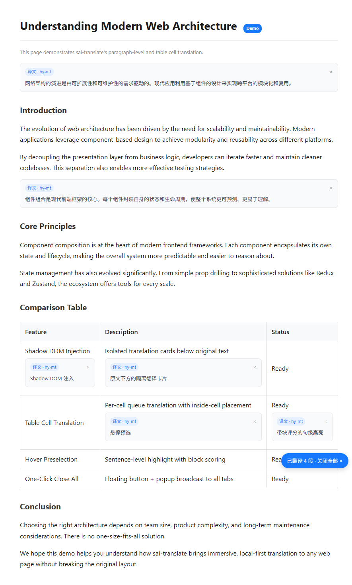

# sai-translate · 本地优先的沉浸式翻译

> 对标「沉浸式翻译」的段落级双语对照扩展，不接入云厂商，只走用户自备的本地模型 `OpenAI 兼容接口`（Ollama / LM Studio / vLLM）。

## 效果预览



上图为真实行下注入效果：段落/列表/标题按块识别、译文以 `Shadow DOM` 卡片贴在原文下方；`Feature` 表格按 `td/th` 逐格队列翻译、注入在单元格内部、不破坏 `TR>TD` 结构。右下角 `已翻译 4 段 · 关闭全部` 为一键清理。

## 特性

- **本地 OpenAI 兼容**：`baseURL + apiKey(可选) + model` 三件套，直调 `POST /v1/chat/completions`，零外发；`hy-mt` 与 `OpenAI SDK` 双后端自动回退
- **沉浸式行下双语**：选中父容器（多 `p/div`）自动展开为段落队列、逐个 `injectLoading → updateCard`，失败可重试，支持 `Alt+Q` 页内快捷键与 `Alt+Shift+T` 系统级 `chrome.commands`
- **表格按格翻译**：`isBlock` 识别 `TD/TH/TR/TABLE` 与 `display:table`，短表头 `minLen 2`，`scoreBlock/placeAfter/observe` 对 `td/th` 改为 `appendChild` 与 `anchor` 自监听，避免 `TR>DIV` 非法
- **Hover 预选**：句级 `Intl.Segmenter` + 块打分，背景/虚线/译图标可单独开关，`MutationObserver` 保活
- **样式隔离**：译文卡片 `Shadow DOM` + 独立 CSS，不染宿主；`storage.local` 持久化站点开关与配置

## 快速开始

```bash
npm install        # 或 bun / pnpm
npm run dev        # Vite + CRXJS fileWriter，产物 dist/
# Chrome → chrome://extensions → 开发者模式 ON → 加载已解压的扩展程序 → 选 dist/
npm run build      # tsc -b && vite build → dist/ + release/crx-sai-translate-<version>.zip
```

## 本地模型配置

Popup → 模型配置 → 添加源：

```
源名称: Ollama
baseURL: http://localhost:11434/v1
apiKey:  (可空)
模型: qwen2.5:7b-instruct
```

扩展经 `background` 转发 `fetch`，规避 `Content → localhost` 的 CORS；`GET /v1/models` 一键连通性检测。

## 使用

- **整页/多段**：选中跨段文字或直接按 `Alt+Q`（无选区时取 `Hover` 预选句/块），父容器自动拆为段落队列、逐段译、逐段贴
- **单句/划词**：悬停见高亮与图标，点击图标或 `Alt+Q` 即译
- **表格**：选区覆盖表格时按可见 `td/th` 队列，译文渲染在格内
- **清理**：`Esc` / 卡片 `×` / 右下角 `关闭全部` / Popup `关闭全部译文`

## 项目结构

```
manifest.config.ts      # defineManifest 唯一声明
vite.config.ts          # solid() → crx({manifest}) → zip()
src/content/            # main.ts / hover.ts / shortcut.ts / inject.ts / utils/selection.ts
src/background/index.ts # OpenAI 转发与限流
src/popup/              # Solid 弹窗（翻译/模型配置/快捷键·Hover）
src/shared/translate.ts # 翻译抽象
docs/images/demo-inline.png # 本文预览图
```

关键实现：`selection.ts: isBlock/scoreBlock/findBestBlock*/getBlocksInRange/expandContainerToParagraphs` · `inject.ts: placeAfter/observe/buildShadow` · `shortcut.ts: handleTranslateSelection/handleTranslateSelection` 队列。

## 文档

- `docs/00-工程目标.md` — 定位/非目标/接口映射
- `docs/shortcut-inline-translation/` — 快捷键与行下嵌入方案
- `docs/crxjs文档/` — CRXJS 体系化笔记 01-07

## 权限

`storage` · `activeTab` · `tabs` · `host_permissions: https://*/*, http://*/*`，本地 `baseURL` 走动态 `http://localhost:*/*`，上架前收窄 `matches`。
