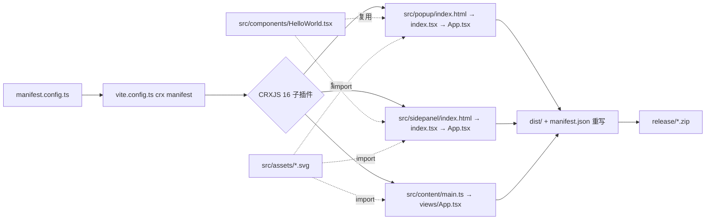

# sai-translate · Solid + Vite + CRXJS

> 基于 `Solid 1.9 + Vite 8 + @crxjs/vite-plugin 2.4` 的 Manifest V3 扩展模板，开箱支持 HMR、SidePanel、Content Script 注入。

## Features

- **Solid + TypeScript** — `jsx: preserve` + `jsxImportSource: solid-js`，细粒度响应式
- **Vite 8** — 秒级冷启 + 原生 HMR
- **CRXJS 2.4** — 以 `manifest.config.ts` 为唯一入口，自动解析 `web_accessible_resources`、生成 `service-worker-loader`、支持 content-script 热更
- **多入口**：Popup / SidePanel / Content Script 三端同构示例
- **一键发包**：`vite-plugin-zip-pack` 输出 `release/crx-sai-translate-<version>.zip`

## Quick Start

```bash
npm install        # 或 bun install / pnpm install
npm run dev        # 启动 Vite + CRXJS fileWriter，产物在 dist/
# Chrome 打开 chrome://extensions → 开发者模式 ON → 加载已解压的扩展程序 → 选 dist/
npm run build      # tsc -b && vite build → dist/ + release/*.zip
npm run preview    # 预览生产包
```

## Project Structure

```
sai-translate/
├── manifest.config.ts      # 扩展唯一声明（defineManifest），CRXJS 解析入口
├── vite.config.ts          # Vite 总装配：solid() → crx({manifest}) → zip()
├── tsconfig.json           # references 聚合
├── tsconfig.app.json       # src/ 编译配置（jsx / paths / types）
├── tsconfig.node.json      # vite.config.ts 编译配置
├── public/logo.png         # 公共图标，原样拷贝到 dist/（fileWriterPublic）
├── docs/                   # CRXJS 体系化文档（01-07）
└── src/
    ├── popup/              # 工具栏弹窗（action.default_popup）
    ├── sidepanel/          # 侧边栏（side_panel.default_path，Chrome 114+）
    ├── content/            # 内容脚本（注入 https://*/*）
    ├── components/         # 跨页面复用组件
    └── assets/             # 被 import 的静态资源（Vite 管线，带 hash 输出）
```

### `src/` 源码职责

#### `src/popup/` — 工具栏弹窗 `action.default_popup = "src/popup/index.html"`

| 文件           | 职责                     | 说明                                                                                                                                                           |
| -------------- | ------------------------ | -------------------------------------------------------------------------------------------------------------------------------------------------------------- |
| `index.html` | **HTML 入口**      | 仅含`<div id="root">` + `<script type="module" src="./index.tsx">`；CRXJS 开发期由 dev server 直出，生产期由 Rollup 打包输出 `dist/src/popup/index.html` |
| `index.tsx`  | **Solid 渲染入口** | `/* @refresh reload */` 开启 HMR；`render(() => <App />, document.getElementById('root')!)` 挂载                                                           |
| `App.tsx`    | **弹窗根组件**     | 展示`vite.svg / solid.svg / crx.svg` 三 logo + `<HelloWorld msg="Vite + Solid + CRXJS">`；新增弹窗交互在此扩展                                             |
| `index.css`  | **全局样式**       | 定义`:root / body / button / a` 基线，`min-width: 450px` 保证弹窗宽度，含 `prefers-color-scheme` 明暗适配                                                |
| `App.css`    | **组件样式**       | `#root` 居中、`logo` 悬浮发光、`.card / .read-the-docs` 卡片样式                                                                                         |

#### `src/sidepanel/` — 侧边栏 `side_panel.default_path = "src/sidepanel/index.html"`

| 文件           | 职责                   | 说明                                                                      |
| -------------- | ---------------------- | ------------------------------------------------------------------------- |
| `index.html` | **HTML 入口**    | 与`popup/index.html` 同构，仅路径不同；Chrome 114+ 以独立侧边栏页面加载 |
| `index.tsx`  | **渲染入口**     | 同`popup/index.tsx`，`render(() => <App />, root)`                    |
| `App.tsx`    | **侧边栏根组件** | 当前与`popup/App.tsx` 内容一致（刻意同构演示）；后续可替换为翻译主界面  |
| `index.css`  | **全局样式**     | 与`popup/index.css` 差异仅在 `body` 未设 `min-width`；其余基线一致  |
| `App.css`    | **组件样式**     | 同`popup/App.css`                                                       |

> 改造指引：若需弹窗/侧边栏差异化，将 `sidepanel/App.tsx` 独立实现即可，两者构建互不干扰，均享受 Vite HMR。

#### `src/content/` — 内容脚本 `content_scripts[0].js = ["src/content/main.ts"]` · `matches: ["https://*/*"]`

| 文件              | 职责               | 说明                                                                                                                                                                                                                                                                                               |
| ----------------- | ------------------ | -------------------------------------------------------------------------------------------------------------------------------------------------------------------------------------------------------------------------------------------------------------------------------------------------- |
| `main.ts`       | **注入入口** | `import { render, createComponent }`；`console.log('[CRXJS] Hello world…')` 验证注入；`mountApp()` 自建 `div#crxjs-app → document.body.append → render(App)` —— 满足 content script 无 HTML 的约束；开发期由 CRXJS `fileWriter` + `content-dev-loader` 注入，改动无需刷新宿主页面 |
| `views/App.tsx` | **悬浮 UI**  | `createSignal(false)` 控制显隐；`toggle` 按钮（`Logo`）+ `HELLO CRXJS` 弹窗；后续翻译划词/浮窗逻辑在此扩展                                                                                                                                                                                 |
| `views/App.css` | **注入样式** | `.popup-container { position:fixed; right:0; bottom:0; z-index:100 }` 固定右下角；`.popup-content` 白底圆角阴影；`.toggle-button` 蓝色圆形按钮；注意 **CSS 会与宿主页面互相影响**，需高特异性或 Shadow DOM 隔离（见 `docs/05`）                                                      |

> 注意：`matches: ["https://*/*"]` 当前为全网注入，**上线前务必收窄**为目标域名（如 `https://translate.google.com/*`），否则商店审核会质疑权限。

#### `src/components/` — 跨入口复用

| 文件               | 职责                 | 说明                                                                                                                                                                                                      |
| ------------------ | -------------------- | --------------------------------------------------------------------------------------------------------------------------------------------------------------------------------------------------------- |
| `HelloWorld.tsx` | **示例计数器** | `props: { msg: string }` + `createSignal(0)`；含 `count is N` 按钮与 `Edit src/components/HelloWorld.tsx to test HMR` 提示；被 `popup/App.tsx` 与 `sidepanel/App.tsx` 复用，验证 HMR 状态保留 |

#### `src/assets/` — 静态资源

| 文件          | 职责       | 说明                                                                                                                                            |
| ------------- | ---------- | ----------------------------------------------------------------------------------------------------------------------------------------------- |
| `vite.svg`  | Vite logo  | `import viteLogo from '@/assets/vite.svg'` → popup/sidepanel 直接 ``；content 中需 `chrome.runtime.getURL(viteLogo)` |
| `solid.svg` | Solid logo | 同上                                                                                                                                            |
| `crx.svg`   | CRXJS logo | 同上，亦被`content/views/App.tsx` 用作悬浮按钮图标                                                                                            |

`@` 为 `vite.config.ts#resolve.alias` 指向 `src/`，所有资源走 Vite 管线，生产输出 `dist/assets/*.svg` 带 hash；`public/logo.png` 则走 `publicDir` 原样拷贝，供 `manifest.icons / action.default_icon` 引用。

### 根配置

| 文件                   | 作用                                                                                                                                                                                         |
| ---------------------- | -------------------------------------------------------------------------------------------------------------------------------------------------------------------------------------------- |
| `manifest.config.ts` | `defineManifest({ manifest_version:3, name/version 来自 package.json, icons, action, side_panel, content_scripts, permissions })`；改扩展能力只改此文件                                    |
| `vite.config.ts`     | `solid() → crx({manifest}) → zip({ outDir:'release', outFileName:'crx-${name}-${version}.zip' })` + `server.cors.origin: [/chrome-extension:\/\//]`；`solid()` 必须在 `crx()` 之前 |
| `tsconfig.app.json`  | `jsx: preserve / jsxImportSource: solid-js / paths @/* / types: [vite/client, @crxjs/vite-plugin/client, chrome]`                                                                          |
| `tsconfig.node.json` | `vite.config.ts` 的编译配置                                                                                                                                                                |
| `public/logo.png`    | 扩展图标（48px），`manifest.icons[48]` 与 `action.default_icon[48]` 共用                                                                                                                 |

### 调用链



## 常用改动配方

| 需求                 | 改动                                                                                                                                    |
| -------------------- | --------------------------------------------------------------------------------------------------------------------------------------- |
| 新增 Options 页      | `manifest.config.ts` 加 `options_page: 'src/options/index.html'`，新建 `src/options/` 复用 `popup/` 结构                        |
| 新增 Background      | `manifest.config.ts` 加 `background: { service_worker: 'src/background/main.ts', type: 'module' }`，新建 `src/background/main.ts` |
| 收窄注入范围         | `manifest.config.ts` 将 `matches` 改为目标域名                                                                                      |
| Shadow DOM 隔离      | 改`src/content/main.ts#mountApp` 为 `attachShadow({mode:'open'})`，CSS 写入 `shadowRoot`                                          |
| 动态 MAIN world 脚本 | 新建`src/injected.iife.ts` 或 `crx({ contentScripts:{ standaloneFiles:['src/injected.ts'] } })`                                     |
| 关闭自动重载         | `vite.config.ts` → `crx({ manifest, liveReload: false })`                                                                          |

## Documentation

本地体系化文档（已采集 CRXJS 官方仓库与源码）：

- `docs/01-概述与核心价值.md` — 定位 / 特性 / 兼容矩阵
- `docs/02-安装与快速开始.md` — 90 秒跑通 Solid 弹窗
- `docs/03-Manifest-配置详解.md` — `defineManifest` / 路径规则 / 字段全览
- `docs/04-扩展页面与静态资源.md` — HTML 额外入口 / WAR 自动生成
- `docs/05-Background与Content-Scripts及HMR原理.md` — Service Worker loader / CSS 热更 / world 与 IIFE
- `docs/06-内部插件架构与进阶配置.md` — 16 子插件职责与 `CrxOptions`
- `docs/07-模板项目入口与文件职责.md` — 本模板逐文件导览（与本 README 互补，含构建产物）

外部：

- [Solid Documentation](https://solidjs.com/docs)
- [Vite Documentation](https://vitejs.dev/)
- [CRXJS Documentation](https://crxjs.dev/vite-plugin)

## Chrome Extension Development Notes

- 以 `manifest.config.ts` 为唯一声明源，CRXJS 自动完成入口发现与资源枚举；额外 HTML 需在 `vite.config.ts#build.rollupOptions.input` 声明
- `side_panel` 需 Chrome 114+，`permissions: ["sidePanel","contentSettings"]` 中后者若未用可移除以减少权限提示
- Content Script 样式会与宿主页面互染，生产建议 Shadow DOM 或 CSS Modules 隔离
