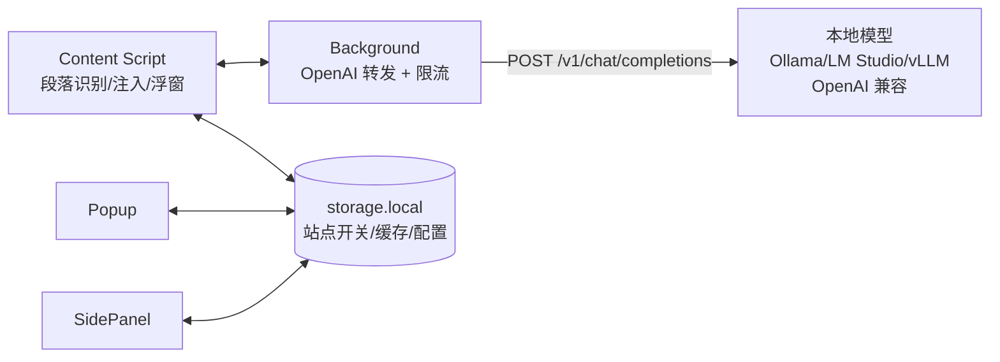

# 00 — sai-translate 工程目标

> 定位：一款对标「沉浸式翻译」的网页翻译扩展，**不接入主流云厂商模型**，只通过**本地模型的 OpenAI 兼容接口**完成翻译。

## 1. 一句话

做「本地优先的沉浸式翻译」—— 在任意网页上实现**段落级双语对照、划词即译、整页沉浸式阅读**，翻译能力完全由用户自备的本地模型（Ollama / LM Studio / vLLM / llama.cpp + OpenAI 兼容网关）提供，扩展本身零模型依赖、零云端密钥。

## 2. 对标沉浸式翻译：学什么

| 沉浸式翻译的核心体验 | sai-translate 要做到 | 刻意不做 |
|---|---|---|
| 段落级双语对照，原译文并排不破坏排版 | DOM 段落识别 + 译文块注入（Shadow DOM 隔离），支持原文/仅译文/对照三态切换 | 不做重排 PDF 引擎、视频双字幕的首版 |
| 划词/句翻译浮窗 | Selection 监听 + 浮窗，支持快捷键 | 不做截图 OCR 首版 |
| 输入框增强、PDF、电子书 | 归为 P2，按里程碑迭代 | 首版只做 HTML 网页 |
| 多引擎可切换 | 改为**单一抽象：OpenAI Chat Completions**，`baseURL + apiKey + model` 三件套 | 不内置 OpenAI/Claude/Gemini 官方端点，不做厂商计费 |

**体验基准**：在 `https://*/*` 的任意文章页，打开开关后 1s 内出现双语对照，滚动不闪烁，排版不崩，不污染宿主样式与事件。

## 3. 核心差异：为什么只做本地 OpenAI 兼容

1. **隐私与成本**：全文翻译走本地，无文本外发；用户已有的 7B/14B 翻译/通用模型即可胜任，无订阅。
2. **单一接口收敛复杂度**：只适配 `POST {baseURL}/v1/chat/completions`（兼容 `/v1/completions` 透传），不为每家云厂商写适配器。任何暴露 OpenAI 协议的本地服务即插即用。
3. **可自愈**：模型可本地微调术语库，扩展只负责「把段落喂给模型、把译文贴回页面」。

> 非目标：不提供模型、不提供托管推理、不代理云端请求。扩展是纯前端 + 轻量 background 转发，**不落盘用户文本**。

## 4. 目标用户

- 已在本地运行 Ollama/LM Studio 等，有 `http://localhost:11434/v1` 类端点的开发者/重度用户
- 对隐私敏感、需离线/内网翻译的团队
- 愿意自备模型、接受本地模型质量波动，换取零外发与零成本

## 5. 核心场景（按优先级）

**P0 — MVP 必须**

- **整页沉浸式双语**：段落识别（`<p>/<li>/<h1-3>/<blockquote>` 等块级）、去重（跳过 `code/pre/nav/footer`）、批量翻译、译文以 Shadow DOM 块注入原文下方，支持「仅译文/对照/原文」切换，状态持久化到 `storage.local`。
- **划词翻译**：选中 1 句~1 段 → 浮窗（content Script `views/`）展示译文 + 复制/朗读占位，`Alt+T` 快捷键。
- **本地模型配置**：Popup/SidePanel 统一配置页：`baseURL` / `apiKey(可选)` / `model` / `systemPrompt` / `并发数` / `超时`，连通性一键检测（`GET /v1/models`）。
- **失败可视**：单段失败不阻塞整页，显示重试；限流/超时/模型不存在给出明确错误码与修复指引。

**P1 — 可用性补齐**

- PDF（基于宿主文本层，非重排）、输入框翻译、术语表/自定义 prompt、缓存（段落 hash → `storage.local`）与去重。
- 站点级开关与黑名单、快捷键自定义。

**P2 — 体验追平**

- 视频字幕双语、EPUB、截图选区（后续评估）。

## 6. 非目标（Explicit Non-Goals）

- 不内置/代理 OpenAI、Claude、Gemini 等云端模型；不提供密钥管理与计费。
- 不做云端术语库/协作；术语表仅本地 `storage.local` + 导入导出。
- 不做模型下载/量化/推理加速，那是 Ollama 等的职责。
- 内容脚本不做全站重写，仅做最小侵入的块级注入。

## 7. 技术栈与约束

- **扩展**：`Solid 1.9 + Vite 8 + @crxjs/vite-plugin 2.4 + Manifest V3`（现模板）。`manifest.config.ts` 为唯一声明源；Popup/SidePanel/Content 三入口。
- **样式隔离**：译文与浮窗必须 Shadow DOM + `:host` + 独立 CSS，避免宿主污染（见 `docs/05`）。
- **权限最小化**：`matches` 从 `https://*/*` 收窄到用户启用的站点；`host_permissions` 动态申请本地 `baseURL`（如 `http://localhost:*/*`、`http://127.0.0.1:*/*`），不申请 `<all_urls>`。
- **性能**：段落批处理（5–10 段/批，`Promise.all` 限并发 3–5），流式可选；滚动/动态加载页需 `MutationObserver` 增量翻译。
- **隐私**：译文请求仅发往用户配置的 `baseURL`，不在 background 落盘；不走第三方。

## 8. OpenAI 接口映射设计（唯一翻译抽象）

```
用户配置
  baseURL: http://localhost:11434/v1
  model:   qwen2.5:7b-instruct
  apiKey:  (可空，Ollama 可不填)

扩展 → POST {baseURL}/chat/completions
  headers: { Authorization: Bearer {apiKey} // 若有 }
  body: {
    model,
    temperature: 0.2,
    messages: [
      { role: "system", content: systemPrompt }, // 默认见下
      { role: "user", content: "Translate to zh:\n\n段落原文" }
    ],
    stream: false // 首版非流式；后续可选 stream
  }
```

**默认 systemPrompt**

> You are a translation engine. Translate the user text to {targetLang} only, keep formatting, do not explain.

- 兼容性：优先 `chat/completions`，若 404 则回退 `/completions`；`GET /v1/models` 用于连通性校验与模型列表拉取。
- 错误映射：`401 → apiKey 错误`、`404 model_not_found → 提示 ollama pull`、`ECONNREFUSED → 本地服务未启动`、`429/timeout → 退避重试`。
- 不做厂商特有参数（`top_p` 等暴露为高级折叠项，不进入 MVP）。

## 9. 架构草图



- Content 负责 DOM，不直接 `fetch` 本地地址（避免 CORS/mixed-content），统一经 Background `fetch` 转发。
- Background 无状态，仅做并发控制与错误归一。
- 配置单源：`storage.local { baseURL, model, apiKey, targetLang, systemPrompt }`，Popup/SidePanel/Content 订阅变更。

## 10. 里程碑

- **M1 模板就绪（当前）**：Solid/CRXJS 三入口可 HMR，`manifest.config.ts` 图标与权限基线完成。
- **M2 MVP**：整页双语 + 划词 + 本地 OpenAI 配置页 + 批处理/重试；`https://*/*` 收窄与 `host_permissions` 动态申请。
- **M3 可用性**：缓存/术语表/站点开关/快捷键；Shadow DOM 样式隔离完善。
- **M4 追平**：流式译文、增量 Mutation、PDF 文本层。

## 11. 成功指标

- 任意 2000 词文章页，本地 7B 模型下整页双语首屏 ≤ 5s，排版零破坏。
- 划词到浮窗 ≤ 500ms（不含模型推理）。
- 配置错误可自诊断：连通性检测一次成功，错误提示命中率 100%。

## 12. 风险与取舍

- 本地模型质量方差大 → 以 prompt 约束 + 段落级短文本 + 低 temperature 缓解，不追 SOTA。
- `http://localhost` 的 CORS/自签名证书 → 经 Background 转发规避 Content 直连限制。
- 商店审核对 `https://*/*` 敏感 → 首版即提供站点开关 + 权限说明，逐步申请可选 host 权限。

---
*本文档为工程北极星：任何需求先问「是否服务于本地 OpenAI 双语沉浸式阅读」，不服务则不做。*
