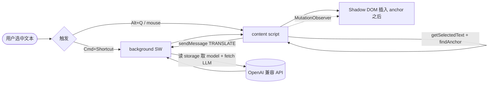

# 方案设计 — sai-translate 快捷键翻译 + 行下嵌入

> 基于 `01-主流方案调研.md`，针对当前 `popup-only` 工程（Solid + CRXJS + `manifest.config.ts` 唯一入口）给出可直接开工的设计。

## 1. 目标与非目标

**做**：
- 选中文本按快捷键在“目标文本正下方”插入译文块（Shadow DOM，保留原文）
- 支持 `Alt+Shift+T`（系统级）与 `Alt+Q`（页内可配置）两条快捷键
- 复用现有 `ModelSource / activeModelId / chrome.storage.local` 与 OpenAI 兼容接口

**不做**（后续迭代）：
- 整页双语对照/段落批量翻译（先做“选中块”）
- OCR/图片翻译
- 词典聚合（仅做 LLM 翻译）

---

## 2. 总览架构



### 2.1 模块划分

| 模块 | 文件 | 职责 |
|---|---|---|
| `manifest` | `manifest.config.ts` | 新增 `commands`、`content_scripts`、`background.service_worker`、`host_permissions` |
| `background` | `src/background/index.ts` | `onCommand` + `onMessage(TRANSLATE)` 统一发请求 |
| `content` | `src/content/main.ts` | 选区捕获、锚点查找、`keydown/mouseup` 监听、注入/更新/移除译文块 |
| `content/ui` | `src/content/views/InlineCard.tsx` | Solid 组件转 Shadow DOM 内的译文卡片（加载/成功/失败/复制/重译/关闭） |
| `shared` | `src/shared/translate.ts` | `extractContent()` + OpenAI 请求体拼装（与 `ModelTranslate.tsx` 共用） |
| `popup` | `src/popup/pages/Settings.tsx` | 新增“快捷键”设置段（显示 `chrome://extensions/shortcuts` 入口 + 页内快捷键改键） |

---

## 3. 交互规格

### 3.1 触发

| 触发器 | 默认 | 行为 | 可配置 |
|---|---|---|---|
| `commands:translate-selection` | `Alt+Shift+T` | 有选区则译选区，无选区则译鼠标最近块 | 用户在 `chrome://extensions/shortcuts` 改 |
| 页内快捷键 | `Alt+Q` | 同上 | 设置页 `storage.local['sai_shortcut_key']` 改，content 热更新 |
| 辅助 | `mouseup 300ms` 后在选区右下角露小图标（可选，默认关） | 点图标等价按快捷键 | 设置页开关 |

- 规则：文本长度 `<2` 或纯 URL/空白不发请求，直接 `toast("未选中有效文本")`
- 防抖：同一 anchor 1s 内重复触发合并为一次

### 3.2 行下嵌入形态

```
原文段落 <p> This is original text.</p>
↓ 按 Alt+Shift+T
原文段落 <p> This is original text.</p>
<div data-sai="1" class="sai-inline-host">  <- shadow
  #shadow-root
    <style>…</style>
    <div class="box">
      <div class="meta">GPT-4o · 中文</div>
      <div class="body">这是原文。</div>
      <div class="actions"><button>复制</button><button>重译</button><button>关闭</button></div>
    </div>
</div>
下一个段落 …
```

- **锚点**：`findBlockAnchor(range)`（见 01），跨多块时取 `range.commonAncestorContainer` 的首个块
- **插入**：`anchor.after(wrapper)`，若已存在 `data-sai` 兄弟则 `replaceWith`（重译）
- **输入框**：无块级锚点，改在 `input/textarea` 下方用 `absolute` 小卡片（`getBoundingClientRect` 定位）
- **关闭**：再按一次快捷键 / 点 `×` / `Esc` / 滚动出视口 500px 自动淡出

### 3.3 译文卡状态

| 状态 | UI |
|---|---|
| `loading` | 骨架 + `翻译中…` + spinner |
| `success` | 译文 + `原文→译文` 方向 + 复制/重译 |
| `error` | `n-alert--error` + 错误信息 + 重试 |
| `empty` | `未配置可用模型，请先去弹窗添加` |

---

## 4. 通信协议

```ts
// content -> background
type TranslateReq = {
  type: 'SAI_TRANSLATE'
  text: string
  target?: string // 默认 '中文'，后续可从 popup 的 target 读
  requestId: string
}
// background -> content
type TranslateRes =
  | { type: 'SAI_TRANSLATE_RESULT'; requestId: string; ok: true; translated: string; model: string }
  | { type: 'SAI_TRANSLATE_RESULT'; requestId: string; ok: false; error: string }
```

- `background` 收到后：`await chrome.storage.local.get([STORAGE_KEY, ACTIVE_KEY])` 取当前模型，回退 `ModelTranslate.tsx` 的 `onTranslate` 同款请求体
- 超时 20s，未响应则 `content` 本地回退 `fetch`（需 `host_permissions`）

---

## 5. Manifest 变更（CRXJS `defineManifest`）

```ts
// manifest.config.ts
export default defineManifest({
  // ...icons/action 保留
  permissions: ['storage', 'commands' /* 可选: 'contextMenus' */],
  host_permissions: ['https://*/*', 'http://*/*'],
  background: { service_worker: 'src/background/index.ts', type: 'module' },
  content_scripts: [{
    js: ['src/content/main.ts'],
    matches: ['<all_urls>'], // 上线前可收窄为 ['https://*/*','http://*/*']
    run_at: 'document_idle',
    all_frames: false,
  }],
  commands: {
    'translate-selection': {
      suggested_key: { default: 'Alt+Shift+T', mac: 'Alt+Shift+T' },
      description: '翻译选中文本并在下方展示',
    },
    'toggle-inline': {
      suggested_key: { default: 'Alt+Shift+Y' },
      description: '显示/隐藏上一次译文',
    },
  },
})
```

`vite.config.ts` 无需改，`crx({manifest})` 会自动处理 `background` 与 `content` 的 `web_accessible_resources` 与 HMR。

---

## 6. 样式与隔离决策

- 采用 `Shadow DOM`（沉浸式方案），`style` 随 shadow 插入，避免被 `* { margin:0 }` 等重置
- 盒模型：`margin 6px 0 10px; border 1px solid #e5e7eb; radius 8px; shadow 0 4px 16px`
- 字体：`inherit` 页面字体，`line-height 1.6`，`max-width` 与 anchor 等宽
- 暗色：`@media (prefers-color-scheme: dark)` 反色，或跟随页面的 `color-scheme`

---

## 7. 存储

| key | 内容 |
|---|---|
| `sai_translate_models` | 已有 `ModelSource[]` |
| `sai_translate_active_model` | 已有 |
| `sai_translate_shortcut_key` | 页内快捷键，如 `'KeyQ'` |
| `sai_translate_inline_enabled` | 是否启用行下嵌入（默认 true） |
| `sai_translate_target_lang` | 默认目标语种（默认 '中文'） |

---

## 8. 异常与边界

- `chrome://`、`edge://`、Chrome Web Store 页不注入（MV3 禁止）
- 跨域 `iframe` 不跟进（`all_frames:false`）
- 页面用 `Shadow DOM` 自身：`getSelection` 需 `shadowRoot.getSelection()` 回退
- 动态页（Notion/飞书/Google Docs）：`contenteditable` 选区用 `window.getSelection` + `Range`，锚点取 `range.startContainer`
- 并发：`Map<requestId, AbortController>`，新请求 arrive 时 abort 旧的

---

## 9. 安全

- API Key 永不注入 content DOM，仅 background 持有
- `content` 发 `text` 到 background 时截断至 4000 字符，防超长 prompt 攻击
- 译文插入前 `textContent` 而非 `innerHTML`，防 XSS（不渲染 HTML）

---

## 10. 度量

- `chrome.storage.local` 存 `sai_stats: { count, avgMs }`，popup 页展示
- 错误埋点：`fetch status / timeout / no model` 分桶

---

## 11. 与现有 popup 的衔接

- `ModelTranslate.tsx` 的 `extractContent` 与 `onTranslate` 请求体抽到 `src/shared/translate.ts`，供 `background` 与 `popup` 共用
- 设置页新增“快捷键”卡片：展示两条 `commands` 的当前绑定 + “去修改”按钮（`chrome.tabs.create({url:'chrome://extensions/shortcuts'})`）
